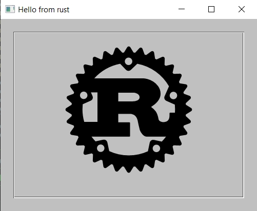

# fltk-rs

Rust bindings for the FLTK Graphical User Interface library.

The FLTK crate is a crossplatform lightweight gui library which can be statically linked to produce small, self-contained (no dependencies) and fast gui applications.
Here is a [list](https://en.wikipedia.org/wiki/FLTK#Use) of software using FLTK.

- [Crate](https://crates.io/crates/fltk)
- [Documentation](https://docs.rs/fltk)
- [Link](https://github.com/fltk/fltk) to the official FLTK repository.
- [Link](https://www.fltk.org/doc-1.3/index.html) to the official documentation.

## Usage
Just add the following to your project's Cargo.toml file:

```toml
[dependencies]
fltk = "^0.2.17"
```

An example hello world application:

```rust
use fltk::{app::*, window::*};

fn main() {
    let app = App::default();
    let mut wind = Window::new(100, 100, 400, 300, "Hello from rust");
    wind.show();
    app.run().unwrap();
}
```

Another example showing the basic callback functionality:
```rust
use fltk::{app::*, button::*, frame::*, window::*};

fn main() {
    let app = App::default();
    let mut wind = Window::new(100, 100, 400, 300, "Hello from rust");
    let mut frame = Frame::new(0, 0, 400, 200, "");
    let mut but = Button::new(160, 210, 80, 40, "Click me!");
    but.set_callback(Box::new(|| frame.set_label("Hello World!")));
    wind.show();
    app.run().unwrap();
}
```
Please check the examples directory for more examples.
You will notice that all widgets are instantiated with a new() method, taking the x and y coordinates, as well as the width and height of the widget. Most widgets, except the TextDisplay and TextEditor, also take a label which can be left blank if needed. Another way to initialize a widget is using the builder pattern: (The following buttons are equivalent)

```rust
let but1 = Button::new(10, 10, 80, 40, "Button 1");

let but2 = Button::default()
    .with_pos(10, 10)
    .with_size(80, 40)
    .with_label("Button 2");
```

An example of a counter showing use of the builder pattern:
```rust
fn main() {
    let app = app::App::default();
    let mut wind = Window::default()
        .with_size(160, 200)
        .center_screen()
        .with_label("Counter");
    let mut frame = Frame::default()
        .with_size(100, 40)
        .center_of(&wind)
        .with_label("0");
    let mut but_inc = Button::default()
        .size_of(&frame)
        .above_of(&frame, 0)
        .with_label("+");
    let mut but_dec = Button::default()
        .size_of(&frame)
        .below_of(&frame, 0)
        .with_label("-");
    but_inc.set_callback(Box::new(|| {
        frame.set_label(&(frame.label().parse::<i32>().unwrap() + 1).to_string())
    }));
    but_dec.set_callback(Box::new(|| {
        frame.set_label(&(frame.label().parse::<i32>().unwrap() - 1).to_string())
    }));
    wind.make_resizable(true);
    wind.show();
    app.run().unwrap();
}
```

### Events
Events can be handled using the set_callback method (as above) or free function, it will handle the default trigger of each widget(like clicks for buttons). For custom event handling, the unsafe set_custom_handler() method can be used:
```rust
    unsafe {
        some_widget.set_custom_handler(Box::new(|ev: app::Event| {
            match ev {
                /* handle ev */
            }
        }));
    }
```

### Theming
FLTK offers 4 application themes (called schemes):
- Base
- Gtk
- Gleam
- Plastic

These can be set using the App::set_scheme() function.
Themes of individual widgets can be optionally modified using the provided methods in the WidgetTrait, such as set_color(), set_label_font(), set_frame_type() etc:
```rust
    some_button.set_color(Color::Light1); // You can use one of the provided colors in the fltk enums
    some_button.set_color(Color::from_rgb(255, 0, 0)); // Or you can specify a color by rgb or hex/u32 value
    some_button.set_color(Color::from_u32(0xffebee));
    some_button.set_frame(FrameType::RoundUpBox);
    some_button.set_font(Font::TimesItalic);
```

## Dependencies

CMake and a C++ compiler need to be installed and in your PATH for a crossplatform build. 
- Windows: No dependencies.
- MacOs: No dependencies.
- Linux: X11 development headers need to be installed for development. 
For Debian-based distribution, that means running:
```
$ sudo apt-get install libx11-dev libxext-dev libxft-dev libxinerama-dev libxcursor-dev libxrender-dev libxfixes-dev
```
For RHEL-based distributions, that means running:
```
$ sudo yum groupinstall "X Software Development" 
```

## Building

To build, just run:
```
$ git clone https://github.com/MoAlyousef/fltk-rs
$ cd fltk-rs
$ cargo build
```

## Examples

To run the examples: 
```
$ cargo run --example editor
$ cargo run --example calculator
$ cargo run --example gallery
$ cargo run --example button
$ cargo run --example terminal
$ cargo run --example counter
$ cargo run --example hello
$ cargo run --example hello_button
$ cargo run --example paint
```



Setting the scheme to Gtk.


Check the full [code](https://github.com/MoAlyousef/fltk-rs/blob/master/examples/counter.rs) for the custom theming.


Setting the scheme to Gtk


## Currently implemented widgets

Most common widgets are implemented: 
- Images (BMP, JPEG, GIF, PNG, SVG)
- Button
- RadioButton
- ToggleButton
- RoundButton
- CheckButton
- LightButton
- RepeatButton
- Native FileDialog
- HelpDialog
- Frame (Fl_Box)
- Window
- DoubleWindow
- MenuWindow
- Group
- Pack
- Tabs
- Scroll
- Tile
- TextDisplay
- TextEditor
- SimpleTerminal
- Input
- IntInput
- FloatInput
- MultilineInput
- SecretInput
- FileInput
- Output
- MultilineOutput
- MenuBar
- MenuItem
- Choice (dropdown list)
- Slider
- NiceSlider
- ValueSlider
- Dial
- LineDial
- Counter
- Scrollbar
- Roller
- Adjuster
- ValueInput
- Browser
- SelectBrowser
- HoldBrowser
- MultiBrowser
- FileBrowser
- Spinner
- Clock
- Chart
- Progress (progress bar)
- ColorChooser
- Drawing primitives

## Todo

- Complete widget set
- Better documentation
- Better testing
- Add tables

## Contributions

Contributions are very welcome!
